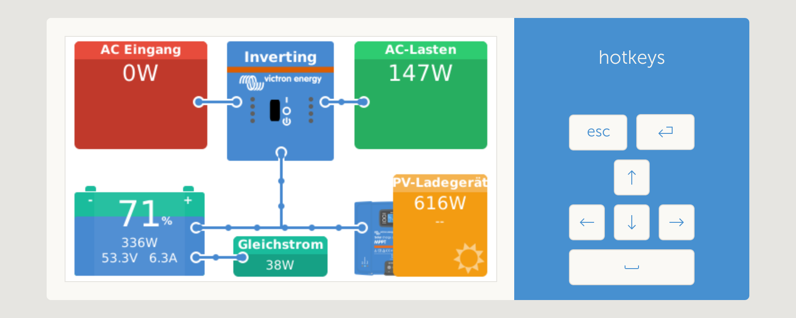
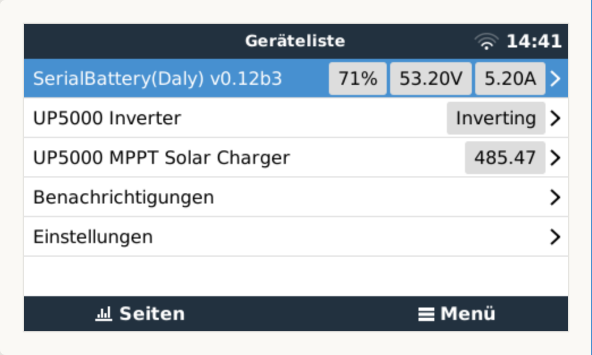
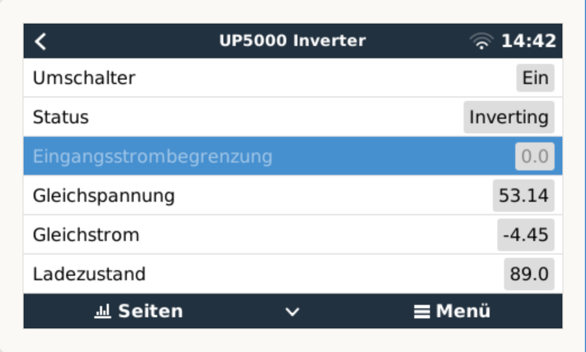
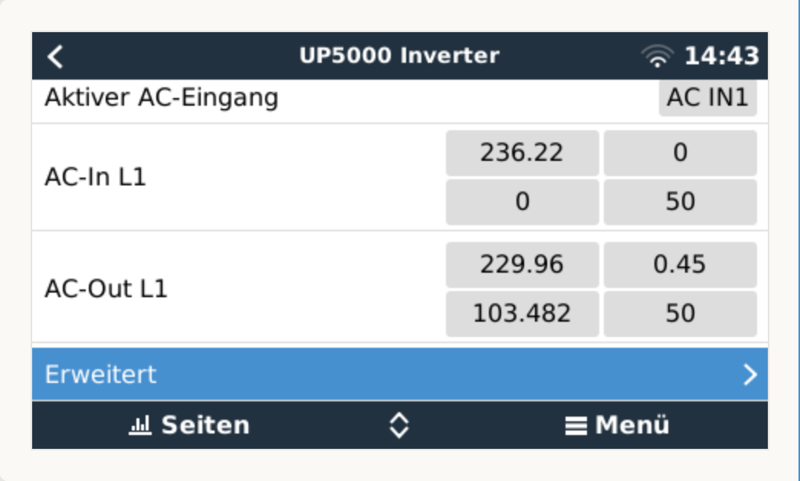
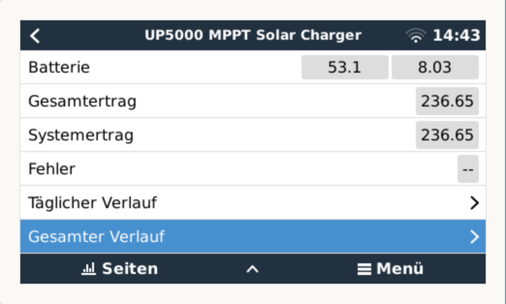
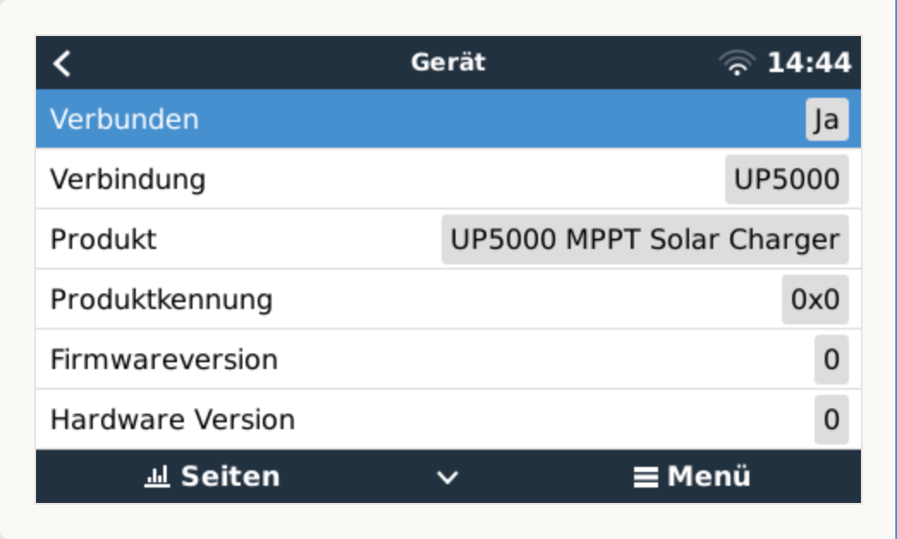
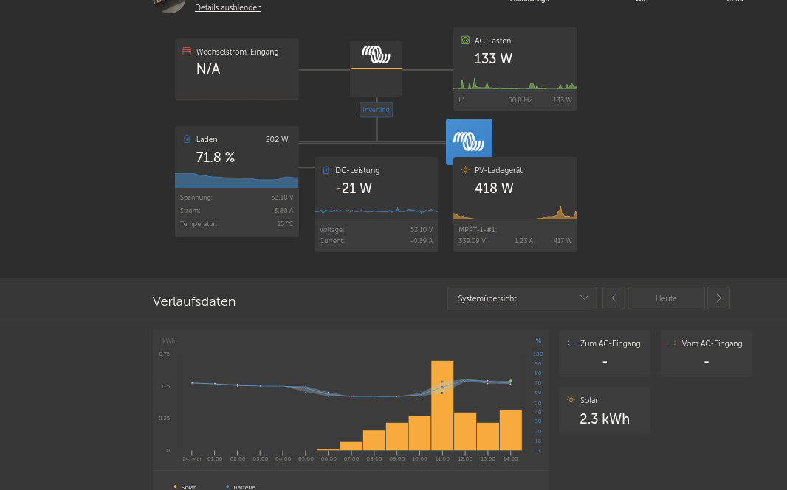

dbus-up5000-hybrid
==================

A venus-os driver for offgridtec/epever/avian/powmr/whatever UP5000-HM8042 hybrid inverters (a Offgridtec_IC-48,
in this case).

This python3 program (venus-os service) provides two dbus-services:

* com.victronenergy.solarcharger.<device>: emulate a victron "pv-charger"
* com.victronenergy.vebus.<device>: emulates a victron multiplus, the "inverter"

For example (dbus-spy):

::

   com.victronenergy.solarcharger.ttyUSB1                                                                                                                                                                                    UP5000 MPPT Solar Charger
   com.victronenergy.vebus.ttyUSB1                                                                                                                                                                                                     UP5000 Inverter

.. contents::

Screenshots
+++++++++++

Some venus-os screenshots of a offgridtec hybrid system:

"Remote Console":

Victron VRM:

Modbus(-RTU) interface
++++++++++++++++++++++

It uses the rs485 modbus interface of the up5000 hybrid inverter (so a rs485<->USB converter
is neccessary to connect the inverter to the system).   

The folder "doc" contains the up5000 modbus register description.

Startup
+++++++

Manual start for testing, usb-serial device to use is given by commandline argument:

::

   python3 /opt/victronenergy/dbus-up5000-hybrid/dbus-up5000-hybrid.py ttyUSB0

To use the venus-os "serial starter", you have to adjust udev-rules and the venus-os configuration
file serial-starter.conf:

::

   Add this to /etc/udev/rules.d/serial-starter.rules (adjust ID_MODEL for your rs485 - usbserial 
   converter):

   ...
   # UP5000 on rs485/modbus
   ACTION=="add", ENV{ID_BUS}=="usb", ENV{ID_MODEL}=="USB2.0-Ser_", ENV{VE_SERVICE}="up5000"
   ...

   Add this to /etc/venus/serial-starter.conf:

   ...
   service up5000          dbus-up5000-hybrid
   ...

DVCC
++++

The BMS-supplied values for MaxChargeVoltage (/Info/MaxChargeVoltage) and MaxDischargeCurrent
(/Info/MaxDischargeCurrent) are used to control the up5000 PV-charger.

:Todo: Make this function configurable.

Excess Power Relay
++++++++++++++++++

The up5000 service is able to control a shelly-like relais (tasmota) using MQTT.
This is used to switch a external load when excess power is available (e.g. when the battery
is full and there is still pv-power available).

:Todo: More description, make this function configurable.

Logfile
+++++++

As all venus-os services, the dbus-up5000-hybrid process creates a logfile in 
/var/log/dbus-up5000-hybrid.<device>/current (/var/log/dbus-up5000-hybrid.ttyUSB0/current for example). 

This can be used for debugging or for informational purposes. Example output:

::

   <snip>
   @4000000064e4bc5c20b19354 22.08.23_15:46:58_CEST INFO:root:update...
   @4000000064e4bc5c20bb6ec4 22.08.23_15:46:58_CEST INFO:root:update(): MaxChargeVoltage info from BMS: 55.2 V
   @4000000064e4bc5c27297594 22.08.23_15:46:58_CEST INFO:root:setChargingVoltage(): cur charging voltage: 55.2.
   @4000000064e4bc5c27359edc 22.08.23_15:46:58_CEST INFO:root:update(): MaxDischargeCurrent info from BMS: 250.0 A
   @4000000064e4bc5c2d212f3c 22.08.23_15:46:58_CEST INFO:root:setDischargeCurrent(): cur Low Voltage Disconnect Voltage: 50.5.
   @4000000064e4bc5c33213db4 22.08.23_15:46:58_CEST DEBUG:root:Reading register 0x3580, 'RegBAVol': 54.15
   @4000000064e4bc5c393c2efc 22.08.23_15:46:58_CEST DEBUG:root:Reading register 0x3500, 'RegGridVol': 239.67
   @4000000064e4bc5d038567c4 22.08.23_15:46:59_CEST DEBUG:root:Reading register 0x3501, 'RegGridCur': 0
   @4000000064e4bc5d0f6eff14 22.08.23_15:46:59_CEST DEBUG:root:Reading long register 0x3502, 'RegGridPow': 0
   @4000000064e4bc5d1590b6bc 22.08.23_15:46:59_CEST DEBUG:root:Reading register 0x3521, 'RegACVol': 229.96
   @4000000064e4bc5d1b8927fc 22.08.23_15:46:59_CEST DEBUG:root:Reading register 0x3522, 'RegACCur': 5
   @4000000064e4bc5d1b93036c 22.08.23_15:46:59_CEST INFO:root:AC power: 1149.800000 (229.960000 * 5.000000)
   @4000000064e4bc5d2779184c 22.08.23_15:46:59_CEST DEBUG:root:Reading long register 0x3557, 'RegPVYield': 535.61
   @4000000064e4bc5d2dc1ad2c 22.08.23_15:46:59_CEST DEBUG:root:Reading register 0x3549, 'RegPVVol': 152.19
   @4000000064e4bc5d3976ee0c 22.08.23_15:46:59_CEST DEBUG:root:Reading long register 0x354b, 'RegPVPow': 1640.66
   @4000000064e4bc5e03ed5154 22.08.23_15:47:00_CEST DEBUG:root:Reading register 0x3581, 'RegBACur': 6.54
   @4000000064e4bc5e09f2d254 22.08.23_15:47:00_CEST DEBUG:root:Reading register 0x3586, 'RegBASoc': 0.79
   @4000000064e4bc5e09fd59a4 22.08.23_15:47:00_CEST INFO:root:no excess power available but keep extra power on: pvvol: 152.19V, pvpow: 1640.66W, soc: 99.1
   @4000000064e4bc5e0ce961bc 22.08.23_15:47:00_CEST DEBUG:root:Reading register 0x3511, 'RegGridChargerState': 1 0x1
   @4000000064e4bc5e0cf9b184 22.08.23_15:47:00_CEST INFO:root:     * Running: True
   @4000000064e4bc5e0cfae234 22.08.23_15:47:00_CEST INFO:root:     * Fault  : False
   @4000000064e4bc5e0d046b9c 22.08.23_15:47:00_CEST INFO:root:     * HOV    : False (Hardware over-voltage)
   @4000000064e4bc5e12e472dc 22.08.23_15:47:00_CEST DEBUG:root:Reading register 0x3559, 'RegPVChargerState': 9 0x9
   @4000000064e4bc5e12f7107c 22.08.23_15:47:00_CEST INFO:root:     * Running   : True
   @4000000064e4bc5e1300577c 22.08.23_15:47:00_CEST INFO:root:     * Fault     : False
   @4000000064e4bc5e13083eec 22.08.23_15:47:00_CEST INFO:root:     * Charg mode: Equalizing charging
   @4000000064e4bc5e13100334 22.08.23_15:47:00_CEST INFO:root:     * Input Voltage: Normal
   @4000000064e4bc5e18dd74a4 22.08.23_15:47:00_CEST DEBUG:root:Reading register 0x3589, 'RegBattState': 0 0x0
   @4000000064e4bc5e18e76b6c 22.08.23_15:47:00_CEST INFO:root:     * Batt state: Normal
   @4000000064e4bc5e1ed5a764 22.08.23_15:47:00_CEST DEBUG:root:Reading register 0x3523, 'RegLoadState': 1 0x1
   @4000000064e4bc5e1ee21ecc 22.08.23_15:47:00_CEST INFO:root:     * Running          : True
   @4000000064e4bc5e1eea8724 22.08.23_15:47:00_CEST INFO:root:     * Fault            : False
   @4000000064e4bc5e1ef291bc 22.08.23_15:47:00_CEST INFO:root:     * Low input voltage: False
   @4000000064e4bc5e1efa1f54 22.08.23_15:47:00_CEST INFO:root:update end
   <snip>

